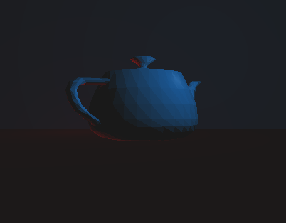

A single file ray tracer written in C++ using only GLM/GLUT/GLEW as part of an university course.
It is very slow and it is only capable of applying Flat Shading to simulate lighting.

Here's a screenshot of a sample scene rendered with it.

